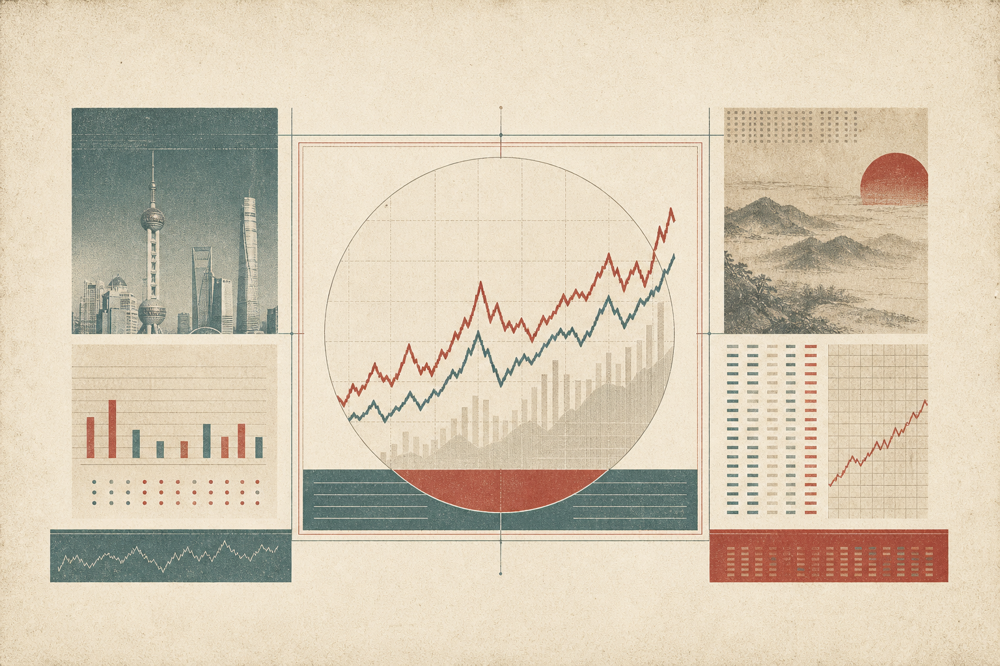

 
 

<h1>A 股研究技能库</h1>

  每日盘面 / 候选筛选 / 公司研究 / 研究复盘 / 新闻映射 / 资本环境

 

 
 

<table>
  <thead>
    <tr>
      <th align="center">技能</th>
      <th align="left">用途</th>
    </tr>
  </thead>
  <tbody>
    <tr>
      <td align="center"><code>ashare-daily-market-review</code></td>
      <td>复盘单个A股交易日的指数、成交、宽度、涨跌停、板块、资金、风格、事件和结构背离。</td>
    </tr>
    <tr>
      <td align="center"><code>ashare-stock-screening</code></td>
      <td>从明确股票池按可审计条件筛选候选，保留数据时点、来源、排除原因和可复现输入摘要。</td>
    </tr>
    <tr>
      <td align="center"><code>ashare-company-research</code></td>
      <td>分析单个 A 股公司，整理财务取证、预期差、催化剂、估值、筹码资金和风险证伪。</td>
    </tr>
    <tr>
      <td align="center"><code>ashare-research-journal</code></td>
      <td>冻结当时研究证据、评价日期和证伪条件；到期后计算收益、超额、回撤、命中率和概率校准。</td>
    </tr>
    <tr>
      <td align="center"><code>ashare-news-investment-targets</code></td>
      <td>从新闻、公告、文章或研报摘录中提取潜在 A 股标的，并按统一口径评分。</td>
    </tr>
    <tr>
      <td align="center"><code>ashare-capital-environment-dashboard</code></td>
      <td>生成 AGUHOT 风格的资本环境仪表盘 HTML：4 市场（全球/美国/中国/韩国）× 7 维度共 28 格证据面板。用 <code>--as-of YYYY-MM-DD</code> 点时回放，只选 <code>publishedAt ≤ asOf</code> 的记录；全未知时显示空状态，严格区分已观测事实与未知，禁出投资建议。</td>
    </tr>
  </tbody>
</table>

 

<h2>入口</h2>

<table>
  <tbody>
    <tr>
      <td align="center"><b>目录</b></td>
      <td align="left"><code>skills/ashare-daily-market-review</code> <code>skills/ashare-stock-screening</code> <code>skills/ashare-company-research</code> <code>skills/ashare-research-journal</code> <code>skills/ashare-news-investment-targets</code> <code>skills/ashare-capital-environment-dashboard</code></td>
    </tr>
    <tr>
      <td align="center"><b>安装</b></td>
      <td align="left"><code>./install.sh</code></td>
    </tr>
    <tr>
      <td align="center"><b>同步</b></td>
      <td align="left"><code>~/.codex/skills/</code> <code>~/.claude/skills/</code></td>
    </tr>
    <tr>
      <td align="center"><b>候选股筛选</b></td>
      <td align="left"><code>python3 skills/ashare-stock-screening/scripts/screen_stocks.py --input stocks.json --as-of YYYY-MM-DD --criterion roe_ttm:gte:15 --sort roe_ttm:desc --output result.json</code> 缺失、未来发布或来源不完整的指标不会静默通过。</td>
    </tr>
    <tr>
      <td align="center"><b>资本环境回放</b></td>
      <td align="left"><code>python3 skills/ashare-capital-environment-dashboard/scripts/gen_dashboard.py --cells cells.json --as-of YYYY-MM-DD --out report.html</code> 每格可提供单条或历史记录数组；生成器按发布日期截止选择最新可用记录。</td>
    </tr>
  </tbody>
</table>

 

<h2>场景</h2>

<table>
  <tbody>
    <tr>
      <td align="center" width="280">
        
         
        <code>ashare-daily-market-review</code>
      </td>
      <td align="left">收盘后复盘A股单日盘面；严格区分available/partial/unknown，计算上涨参与度、成交变化和指数—宽度背离，不替代多市场宏观资本环境。</td>
    </tr>
    <tr>
      <td align="center" width="280">
        
         
        <code>ashare-stock-screening</code>
      </td>
      <td align="left">先从全A股、指数成分股或自定义列表筛出候选，再把选中的公司交给深度研究；筛选结果只说明是否通过显式条件，不产生隐藏评分或自动荐股。</td>
    </tr>
    <tr>
      <td align="center" width="280">
        
         
        <code>ashare-company-research</code>
      </td>
      <td align="left">全面分析单个 A 股公司；观察 1 周到 6 个月的财务质量、预期差、催化剂、估值空间、筹码资金和风险证伪。</td>
    </tr>
    <tr>
      <td align="center" width="280">
        
         
        <code>ashare-research-journal</code>
      </td>
      <td align="left">用户明确要求保存时，冻结研究快照；到期后追加真实价格路径，区分市场结果、证伪触发和研究校准，不事后改写原判断。</td>
    </tr>
    <tr>
      <td align="center" width="280">
        
         
        <code>ashare-news-investment-targets</code>
      </td>
      <td align="left">从新闻、公告、文章或研报里提取受益标的；适合 A 股机会、海外映射和受益股评分。</td>
    </tr>
    <tr>
      <td align="center" width="280">
        
         
        <code>ashare-capital-environment-dashboard</code>
      </td>
      <td align="left">生成资本环境仪表盘 HTML：4 市场 × 7 维度的证据面板；用 <code>--as-of</code> 生成真实点时快照，全未知时不伪造矩阵；只描述环境状态与证据，不给投资建议。</td>
    </tr>
  </tbody>
</table>

 

<h2>边界</h2>

<table>
  <tbody>
    <tr>
      <td align="center">研究框架和情景推演，不构成个性化投资建议。</td>
    </tr>
  </tbody>
</table>

